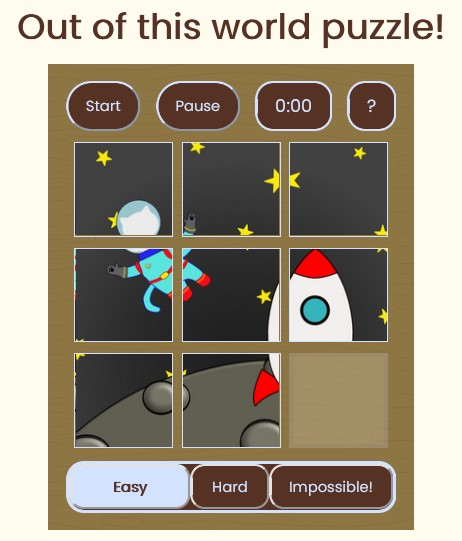

# Description 
A sliding puzzle game with three levels of fun! Choose from an 8 piece or 15 piece or 24 piece sliding puzzle. Press the start button to shuffle the pieces and then try to solve the puzzle. For each puzzle there is three different starting puzzle piece positions. How fast can you solve the puzzle?

# Motivation
A fun project to help me learn JavaScript which also allowed me to have some fun illustrating.

# Built With
HTML, CSS and JavaScript.

# Demo Site
https://isabelmcilroy.github.io/puzzleGame/

